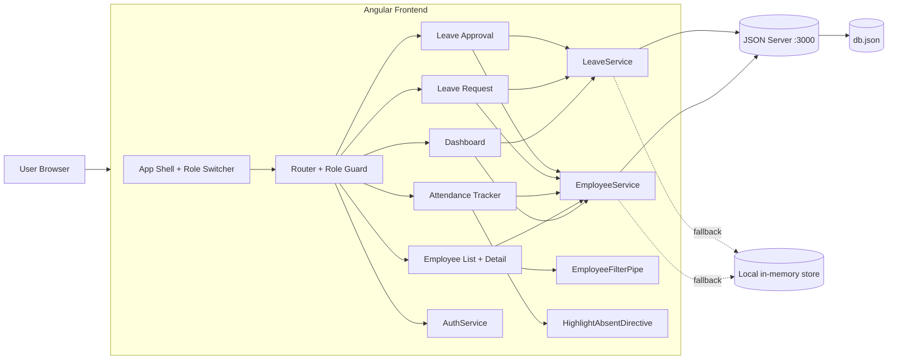

# Employee Attendance and Leave Management System

Angular + TypeScript + Angular Material application for employee management, attendance tracking, leave requests, and HR leave approval.

## Architecture Diagram



## Current Status

This repository is **actively implemented and runnable** with:

- Employee CRUD (add/edit/delete)
- Daily attendance tracking (present/absent)
- Leave request submission (reactive form)
- Leave approval/rejection (HR-only route)
- Dashboard summary cards and attendance progress
- Department filter pipe and absent-row highlight directive
- Route guard + role switching in navbar
- Mock backend support with JSON Server
- Offline fallback mode when API is unavailable
- Role-based coverage with shared Leave Request access for Employee and HR

## Tech Stack

- Angular 20 (standalone components)
- TypeScript
- Angular Material
- RxJS
- JSON Server (mock API)

## Project Structure

```text
attendance-management-backup/
├── db.json
├── package.json
├── src/
│   ├── attendance.model.ts
│   ├── employee.model.ts
│   ├── leave.model.ts
│   ├── main.ts
│   └── app/
│       ├── app.component.*
│       ├── app.routes.ts
│       ├── components/
│       │   ├── dashboard/
│       │   ├── employee-list/
│       │   ├── employee-detail/
│       │   ├── attendance-tracker/
│       │   ├── leave-request/
│       │   └── leave-approval/
│       ├── dialogs/
│       │   └── employee-form-dialog/
│       ├── directives/
│       │   └── highlight-absent.directive.ts
│       ├── guards/
│       │   └── role.guard.ts
│       ├── pipes/
│       │   └── employee-filter.pipe.ts
│       └── services/
│           ├── employee.service.ts
│           ├── leave.service.ts
│           ├── auth.service.ts
│           └── data.service.ts (legacy/unused)
└── ...
```

## Routes

- `/dashboard` (HR only)
- `/employees` (HR only)
- `/employees/:id` (HR only)
- `/attendance` (HR only)
- `/leave-request` (Employee and HR)
- `/leave-approval` (HR only)

## Prerequisites

- Node.js 18+
- npm 9+

## Installation

```bash
npm install
```

## Run the App

### Recommended (with mock API persistence)

Use two terminals:

**Terminal 1 (mock API):**
```bash
npm run start:api
```

**Terminal 2 (Angular app):**
```bash
npm start
```

Open: `http://localhost:4200`

### Frontend-only mode (no API)

You can run only Angular:

```bash
npm start
```

If `http://localhost:3000` is unavailable, services automatically fall back to local in-memory data so the UI still works.

## Build

```bash
npm run build
```

## Test

```bash
npm test
```

## Role Switching and Access

Role selector is available in the top navbar:

- **Employee**
  - Can access Leave Requests (`/leave-request`)
  - Dashboard, Employees, Attendance, and Leave Approval are hidden and route-blocked
  - Switching to Employee redirects to Leave Requests

- **HR**
  - Can access Dashboard, Employees, Attendance, Leave Requests, and Leave Approval
  - Leave Request remains visible for HR

## Forms and Validation

- **Template-driven form**: Employee add/edit dialog
- **Reactive forms**:
  - Leave request submission
  - Leave approval decision form
- Includes required field checks and date-range validation for leave request

## API Endpoints (JSON Server)

From `db.json`:

- `GET/POST/PATCH/DELETE /employees`
- `GET/POST/PATCH /attendance`
- `GET/POST/PATCH /leaveRequests`

## Troubleshooting

### 1) `ERR_CONNECTION_REFUSED` for `:3000`

- Start API server with `npm run start:api`
- Or continue using frontend-only mode (offline fallback is enabled)

### 2) `Unknown` employee names in leave approval

- Ensure employee list is loaded (it now uses normalized ID mapping)
- Refresh the page after starting API if you switched modes

### 3) HR page not accessible

- Switch role to `HR` from navbar
- Route guard blocks non-HR users by design

### 4) Employee cannot open Dashboard/Employees/Attendance/Leave Approval

- This is expected behavior with role-based access control
- Employee role is intentionally limited to leave request submission

### 5) Build warning about `data.service.ts` unused

- This is legacy after migration to `employee.service.ts` / `leave.service.ts`
- Safe to remove in cleanup, but does not block runtime


## Useful Commands

```bash
# Start Angular app
npm start

# Start mock backend
npm run start:api

# Build app
npm run build

# Run tests
npm test
```
